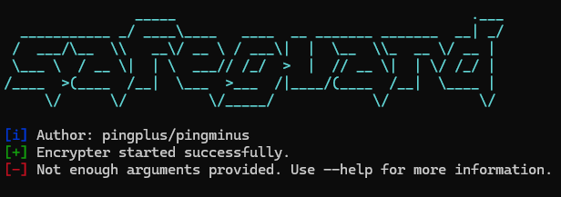

<div align="center">
  
</div>

```bash
./safeguard --version
1.0
```

<br>
<div align="center">
  
</div>
<br>
<br>
Safeguard is a fast, lightweight, cross-platform command-line file encryption tool written in Go.

---

## ⚠️ Security Notice

This project is a learning-oriented file encryption tool.

While it uses standard cryptographic primitives from Go’s standard library
(e.g. AES-GCM for authenticated encryption), it does **not** use a modern,
memory-hard password key derivation function such as Argon2 or scrypt.

Instead, keys are derived using a lightweight, standard-library-only method.
This means:

- The encryption is **secure against casual inspection**
- Integrity and tampering are **detected**
- Passwords are **not strongly protected** against determined brute-force or GPU-based attacks

### Do NOT use this tool for:

- High-value secrets
- Long-term storage of sensitive data
- Situations requiring strong password-hardening guarantees

### Intended use:

- Learning and experimentation
- Personal or low-risk file protection
- Open-source collaboration and improvement

Contributions that improve security while preserving usability are welcome.

---

## Installation

### Build (req. Go)

```bash
git clone https://github.com/pingplus/safeguard.git
cd safeguard
go build -o encrypter
```

## Usage

General syntax:

```bash
./safeguard <file> <action> <cipher> [options]
```

Actions:

- `--encrypt` or `e` Encrypt a file
- `--decrypt` or `d` Decrypt a file
- `--decrypt-directory` or `de` Decrypt a whole directory (decrypting directory not available yet sorry :( )

Options:

- `--inplace` decrypt/encrypt a file in place (experimental)
- `--key` add key
- `--output` specify the output name

Supported ciphers:

```bash
./safeguard --list-ciphers
[i] Available ciphers:
  xor
  caesar
  aes
```

---

## AES

Encrypt a file:

```bash
encrypter secret.txt e aes --key "your-strong-password"
# or
encrypter secret.txt --encrypt aes --key "your-strong-password" --output secret.txt.aes
```

Decrypt a file:

```bash
./safeguard secret.txt d aes --key "your-strong-password"
# or
./safeguard secret.txt --decrypt aes --key "your-strong-password" --output secret.txt.dec
```

---

## More Examples

- Encrypt with AES and write in place:

```bash
./safeguard secrets.txt e aes --key "123123123123123123123123" --inplace
# -> creates secrets.txt but encrypted
```

- Decrypt with AES and specify output file :

```bash
./safeguard secrets.txt.aes d aes --key "123123123123123123123123" --output secrets_decrypted.txt
```
